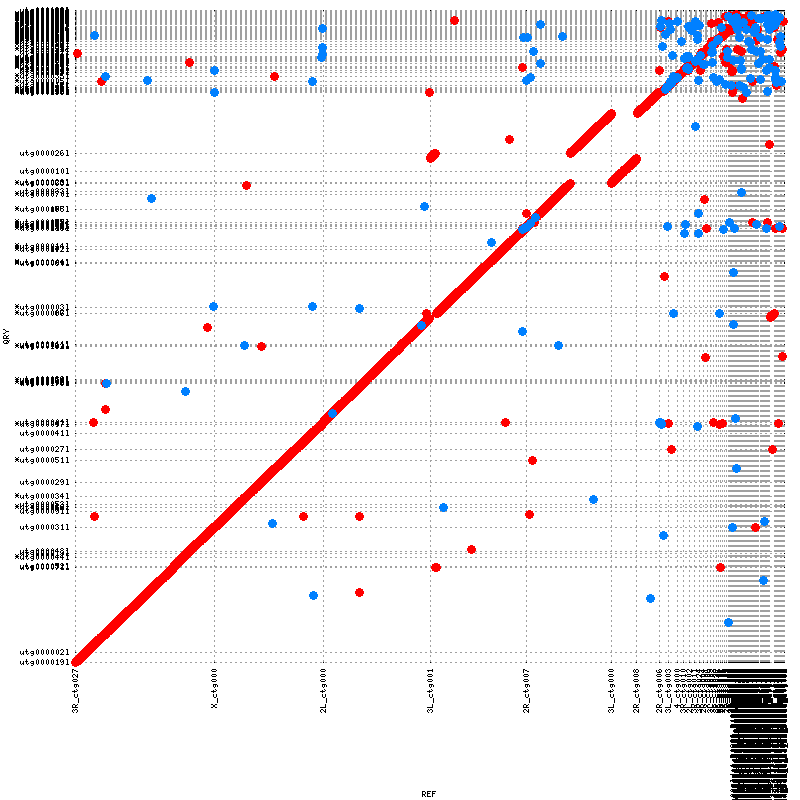
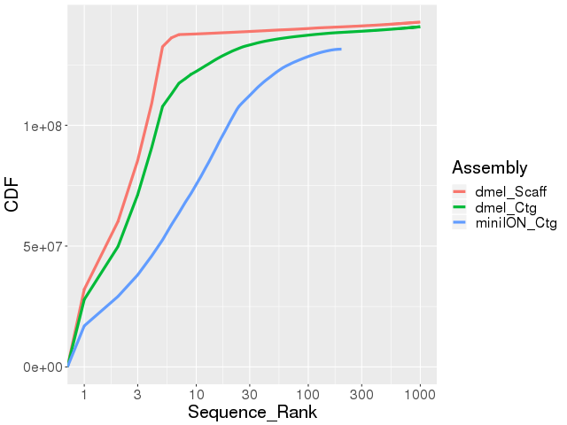

Homework 4 answers
======================

Part1 : Summarize partitions of a genome assembly
-----------------------------------------------------

Answers and code for this section will be in the Partitions_genome_assembly directory
-----------------------------------------------------------------------------------------

For this section the Drosophila melanogaster genome was used: dmel-all-chromosome-r6.24.fasta

bioawk was used to partition the genome into over 100kb and under 100kb:

```bash

bioawk -c fastx 'length($seq) > 100000{ print ">"$name; print $seq }'  dmel-all-chromosome-r6.24.fasta > dmel-all-chr-over100kb.fasta

bioawk -c fastx 'length($seq) <= 100000{ print ">"$name; print $seq }'  dmel-all-chromosome-r6.24.fasta > dmel-all-chr-less_eq_100kb.fasta

```

##Calculate the following for Whole genome

```bash

faSize dmel-all-chromosome-r6.24.fasta

```

1. Total number of nucleotides: 143726002 bases
2. Total number of Ns: 1152978 N's
3. Total number of sequences: 1870 sequences

##Calculate the following for >100kb:

```bash

faSize dmel-all-chr-over100kb.fasta

```

1. Total number of nucleotides: 137547960  bases
2. Total number of Ns: 490385  N's
3. Total number of sequences: 7 sequences


##Calculate the following for <= 100kb:

```bash

faSize dmel-all-chr-less_eq_100kb.fasta

```

1. Total number of nucleotides: 6178042  bases
2. Total number of Ns: 662593  N's
3. Total number of sequences: 1863 sequences


Plots of the following for the whole genome, for all sequences <= 100kb, and all sequences > 100kb:
---------------------------------------------------------------------------------------------------------

1. Sequence length distribution

###Will use this file to plot both sequence length distribution and cumulative genome size sorted from largest to smallest

The same code was used for whole genome, >100kb, and <=100kb, changing the input file to the files containing reads from 
the whole genome, >100kb, and <=100kb

```bash

bioawk -c fastx '{ print $name, length($seq) }' dmel-all-chromosome-r6.24.fasta > Sequence_length.txt

```

2. Sequence GC% distribution

##The GC content:

The same code was used for whole genome, >100kb, and <=100kb, changing the input file to the files containing reads from
the whole genome, >100kb, and <=100kb

```bash

bioawk -c fastx '{ print $name, gc($seq) }' dmel-all-chromosome-r6.24.fasta > GC_content.txt

```

3.  Cumulative genome size sorted from largest to smallest sequences

The sequence length distribution file for each genome size file (whole, >100kb, and <=100kb) will be used to plot both sequence length 
distribution and cumulative genome size sorted from largest to smallest

PLOTS
======

R code for plots. This code includes the code for the 9 plots. The plots for each question have the same scale, except for 3 additional plots
(for a total of 12 plots) in the >100kb section.  Since there are only 7 sequences over 100kb, the scale of the extra 3 plots was reduced.

```
#install.packages("ggplot2")
library(ggplot2)
#if(!require(devtools)) install.packages("devtools")
#devtools::install_github("kassambara/ggpubr")

##Whole GENOME
setwd("D:/DATA/UC Irvine/JJEMERSON_CLASS_2018/homework4/whole")
dmel <- read.table("GC_content.txt", header = FALSE)

#qplot(dmel_l$V2, geom="histogram") 


a <- ggplot(data=dmel, aes(dmel$V2)) + geom_histogram(
  bins = 10 ,
  fill="red",alpha = .5) +
  labs(title="Whole_Genome_GC_Content") +
  labs(x="GC_Content", y="Count") 

print(a)


dmel_l <- read.table("Sequence_length.txt", header = F, row.names=1)
log <- log10(dmel_l)

b <- ggplot(data=log, aes(log$V2)) + geom_histogram(
  bins = 10 ,
  #binwidth = 1000
  fill="green", alpha=0.5) +
  labs(title="Length_Distribution_Whole") +
  labs(x="sequence_length_base(log10)", y="Count") 

print(b)

#sort in decending order
data <- as.data.frame(dmel_l[order(-dmel_l$V2),])
colnames(data)[1] <- "V2"
#data <- dmel_l[order(-dmel_l$V2),]
#Cumulative genome size 
data$n_seqs <- 1:nrow(data)
data$gen_size <- cumsum(data$V2)

c <- ggplot(data, aes(n_seqs, gen_size)) + geom_point()+ geom_line()

print(c)

##GENOME over 100kb
setwd("D:/DATA/UC Irvine/JJEMERSON_CLASS_2018/homework4/over100kb")
dmel_over <- read.table("GC_content.txt", header = FALSE)
d <- ggplot(data=dmel_over, aes(dmel_over$V2)) + geom_histogram(
  bins = 10 ,
  fill="purple",alpha = .5) +
  labs(title="GC_Content_over100kb") +
  labs(x="GC_Content", y="Count") +
  coord_cartesian(xlim=c(0,0.75),ylim=c(0,700))

print(d)

e <- ggplot(data=dmel_over, aes(dmel_over$V2)) + geom_histogram(
  bins = 10 ,
  fill="purple",alpha = .5) +
  labs(title="GC_Content_over100kb") +
  labs(x="GC_Content", y="Count") +
  coord_cartesian(xlim=c(0,0.75),ylim=c(0,5))

print(e)

dmel_over_l <- read.table("Sequence_length.txt", header = F, row.names=1)
log_over <- log10(dmel_over_l)

f <- ggplot(data=log_over, aes(log_over$V2)) + geom_histogram(
  bins = 10 ,
  #binwidth = 1000
  fill="orange", alpha=0.5) +
  labs(title="Length_Distribution_over100kb") +
  labs(x="sequence_length_base(log10)", y="Count")+
  coord_cartesian(xlim=c(0,9),ylim=c(0,1500))

print(f)

g <- ggplot(data=log_over, aes(log_over$V2)) + geom_histogram(
  bins = 10 ,
  #binwidth = 1000
  fill="orange", alpha=0.5) +
  labs(title="Length_Distribution_over100kb") +
  labs(x="sequence_length_base(log10)", y="Count")+
  coord_cartesian(xlim=c(0,9),ylim=c(0,7))

print(g)
```
```
##sort in decending order
data_over_l <- dmel_over_l[order(-dmel_l$V2),]
#Cumulative genome size 
data_over_l <- as.data.frame(dmel_over_l[order(-dmel_over_l$V2),])
colnames(data_over_l)[1] <- "V2"
#data <- dmel_l[order(-dmel_l$V2),]
#Cumulative genome size 
data_over_l$n_seqs <- 1:nrow(data_over_l)
data_over_l$gen_size <- cumsum(data_over_l$V2)

h <- ggplot(data_over_l, aes(n_seqs, gen_size)) + geom_point()+ geom_line()+
  coord_cartesian(xlim=c(0,2000),ylim=c(0,150000000))

print(h)

##GENOME under 100kb
setwd("D:/DATA/UC Irvine/JJEMERSON_CLASS_2018/homework4/under100kb")
dmel_under <- read.table("GC_content.txt", header = FALSE)
i <- ggplot(data=dmel_under, aes(dmel_under$V2)) + geom_histogram(
  bins = 10 ,
  fill="blue",alpha = .5) +
  labs(title="GC_content_under100kb") +
  labs(x="GC_Content", y="Count")
  #coord_cartesian(xlim=c(0,0.75),ylim=c(0,700))

print(i)

dmel_under_l <- read.table("Sequence_length.txt", header = F, row.names=1)
log_under <- log10(dmel_under_l)

k <- ggplot(data=log_under, aes(log_under$V2)) + geom_histogram(
  bins = 4 ,
  #binwidth = 1000
  fill="yellow", alpha=0.5) +
  labs(title="Length_Distribution_under100kb") +
  labs(x="sequence_length_base(log10)", y="Count")+
  coord_cartesian(xlim=c(0,9),ylim=c(0,1500))

print(k)

#sort in decending order
data_under_l <- dmel_under_l[order(-dmel_under_l$V2),]
#Cumulative genome size 
data_under_l <- as.data.frame(dmel_under_l[order(-dmel_under_l$V2),])
colnames(data_under_l)[1] <- "V2"
#data <- dmel_l[order(-dmel_l$V2),]
#Cumulative genome size 
data_under_l$n_seqs <- 1:nrow(data_under_l)
data_under_l$gen_size <- cumsum(data_under_l$V2)

l <- ggplot(data_under_l, aes(n_seqs, gen_size)) + geom_point()+ geom_line()+
  coord_cartesian(xlim=c(0,2000),ylim=c(0,150000000))

print(l)

m <- ggarrange(a, b, c, d, e, f, g, h, i, k, l,
          ncol = 2, nrow = 2)

ggexport(m)

```

Plots in PDF format
--------------------

To make the plots ggplot2 was used using the geom_histogram function, the geom_point, and geom_line functions in ggplot2.  ggarrange and ggexport were used to arrange all of the plots and export to a single pdf document. The code is in the .R file Plots.R

All plots are in one pdf file: Plots_over_under_whole.pdf

Part 2: Genome assembly
-----------------------

##Code and files from Part 2 are in the Genome_assembly directory

###Assemble a genome from MinION reads

The code and files generated for this section are in the Assemble_MinION_reads direcotry. The output are in the nanopore_assembly/data/processed directory within Assemble_miniION_reads directory.

```
#!/bin/bash

#$ -N assemble_mini.log
#$ -q sam,bio,som
#$ -pe openmp 12
#$ -ckpt blcr
#$ -l kernel=blcr
#$ -r y
#$ -M crwilcox@uci.edu
#$ -m be

module load jje/jjeutils
minimap=$(which minimap)
miniasm=$(which miniasm)
basedir=/pub/jje/ee282/crwilcox/homework4_EE282/Genome_assembly/Assemble_MinION_reads
projname=nanopore_assembly
basedir=$basedir/$projname
raw=$basedir/$projname/data/raw
processed=$basedir/$projname/data/processed
figures=$basedir/$projname/output/figures
reports=$basedir/$projname/output/reports

createProject $projname $basedir
ln -sf /bio/share/solarese/hw4/rawdata/iso1_onp_a2_1kb.fastq $raw/reads.fq

$minimap -t 32 -Sw5 -L100 -m0 $raw/reads.fq{,} \
| gzip -1 \
> $processed/onp.paf.gz

$miniasm -f $raw/reads.fq $processed/onp.paf.gz \
> $processed/reads.gfa

awk ' $0 ~/^S/ { print ">" $2" \n" $3 } ' $processed/reads.gfa \
| fold -w 60 > $processed/unitigs.fa
```


###Assembly assessment

1. the N50 was calculated using the code below:

```

bioawk -c fastx '{li=length($seq); l=li+l; print li;} END {print l;}' unitigs.fa | sort -rn | gawk -v np=0.5 'NR==1 {l=$1;} NR>1 {li=$1; lc=li+lc; if(lc/l >= np) {print li; exit;} }'

```

The NP50 generated by the script above for the miniION assembly is:
###4494246

The Drosophila community reference's contig NP50 is:
###21,485,538

2. Compare your assembly to the contig assembly from Drosophila melanogaster on FlyBase using a dotplot constructed with MUMmer

```

#!/usr/bin/bash

###Loading of binaries via module load or PATH reassignment
source /pub/jje/ee282/bin/.qmbashrc
module load gnuplot/4.6.0
module load perl
module load jje/jjeutils/0.1a

###Query and Reference Assignment. State my prefix for output filenames
dmel="dmel-all-chromosome-r6.24.fasta"
REF=dmel_contigs
faSplitByN $dmel $REF 10

module unload perl
module unload jje/jjeutils/0.1a

PREFIX="flybase"
SGE_TASK_ID=1
QRY="./Assemble_MinION_reads/nanopore_assembly/nanopore_assembly/data/processed/unitigs.fa"
PREFIX=${PREFIX}_$(basename ${QRY} .fa)


##please use a value between 75-150 for -c. The value of 1000 is too strict.
ucmer -l 100 -c 100 -d 10 -banded -D 5 -prefix ${PREFIX} ${REF} ${QRY}
mummerplot --fat --layout --filter -p ${PREFIX} ${PREFIX}.delta \
  -R ${REF} -Q ${QRY} --png

``` 
The resulting plot:


3. Compare your assembly to both the contig assembly and the scaffold assembly from the Drosophila melanogaster on FlyBase using a contiguity plot

```bash

#!/usr/bin/env bash
#$ -N fifo

module load perl
module load jje/jjeutils/0.1a
module load R/3.5.1
#module load rstudio/0.99.9.9

dmel="dmel-all-chromosome-r6.24.fasta"
miniION="./Assemble_MinION_reads/nanopore_assembly/nanopore_assembly/data/processed/unitigs.fa"

#scratchdir=/pub/jje/ee282/$USER/homework4_EE282/Genome_assembly
#mkdir -p $scratchdir; cd $scratchdir

#mkfifo {r6scaff,r6ctg,truseq}_fifo

bioawk -c fastx ' { print length($seq) } ' $dmel | sort -rn | awk ' BEGIN { print "Assembly\tLength\ndmel_Scaff\t0" } { print "dmel_Scaff\t" $1 } ' > dmel_scaf_length

faSplitByN $dmel  /dev/stdout 10 | bioawk -c fastx ' { print length($seq) } ' | sort -rn | awk ' BEGIN { print "Assembly\tLength\ndmel_Ctg\t0" } { print "dmel_Ctg\t" $1 } ' > dmel_contig_length

bioawk -c fastx ' { print length($seq) } ' $miniION  | sort -rn | awk ' BEGIN { print "Assembly\tLength\nminiION_Ctg\t0" } { print "miniION_Ctg\t" $1 } ' > miniION_length_unitigs

plotCDF2 {dmel_scaf_length,dmel_contig_length,miniION_length_unitigs} dmel_v_nanoION.png

#rm {r6scaff,r6ctg,truseq}

```

The resulting png plot:



4. Calculate BUSCO scores of both assemblies and compare them

```
#!/bin/bash

#$ -N busco.log
#$ -pe one-node-mpi 32
#$ -R y
#$ -S /bin/bash
#$ -q som,bio,sam,pub8i
#$ -ckpt blcr
#$ -l kernel=blcr
#$ -j y
#$ -cwd

module load augustus/3.2.1
module load blast/2.2.31 hmmer/3.1b2 boost/1.54.0
source /pub/jje/ee282/bin/.buscorc

INPUTTYPE="geno"
MYLIBDIR="/pub/jje/ee282/bin/busco/lineages/"
MYLIB="diptera_odb9"
OPTIONS="-l ${MYLIBDIR}${MYLIB}"
##OPTIONS="${OPTIONS} -sp 4577"
QRY="./Assemble_MinION_reads/nanopore_assembly/data/processed/unitigs.fa"
MYEXT=".fa" ###Please change this based on your qry file. I.e. .fasta or .fa or .gfa

#my busco run
BUSCO.py -c 32 -i ${QRY} -m ${INPUTTYPE} -o $(basename ${QRY} ${MYEXT})_${MYLIB}${SPTAG} ${OPTIONS}

```
The results for BUSCO are in the run_unitigs directory

#This completes homework4_EE282
